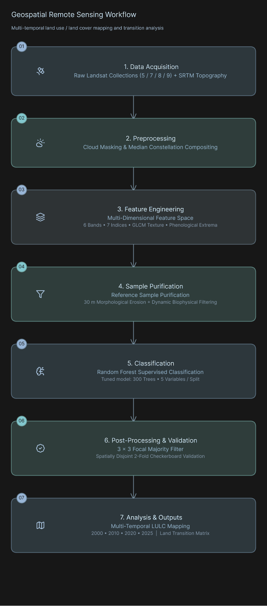
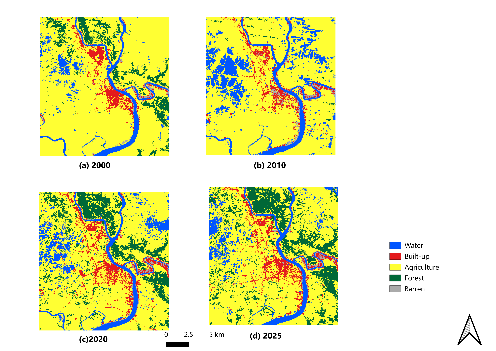

# Multi-Temporal Land Use / Land Cover (LULC) Classification and Landscape Dynamics in Khulna, Bangladesh (2000–2025)

[](https://earthengine.google.com/)
[](https://qgis.org/)
[](#)

---

Monitoring long-term surface transitions in dynamic coastal delta systems is challenging due to frequent cloud cover, tidal variations, complex mixed pixels, and overlapping spectral signatures among crop fields, fallow ponds, and rural homesteads.

This project explores a multi-temporal Land Use and Land Cover (LULC) classification framework across the Khulna metropolitan and peri-urban region in southwestern Bangladesh across four epochs: **2000, 2010, 2020, and 2025**. Using the computational power of the Google Earth Engine (GEE) JavaScript API alongside QGIS, the primary aim was to move beyond standard baseline classification and construct an empirical, step-by-step optimization pipeline.

Through 25 iterative experimental phases, the workflow tackles critical coastal remote sensing problems: reference label noise, feature correlation, hyperparameter tuning, and spatial autocorrelation. The end result tracks 25 years of landscape modification, providing insight into urbanization, agricultural displacement, and vegetative cover shifts.

> **Disclaimer:** This project was developed as an advanced technical practice project to demonstrate end-to-end capabilities across GIS, satellite remote sensing, machine learning, and spatial validation.

---

## Study Area

The analysis focuses on the coastal deltaic plain of Khulna, bounded along the Rupsha and Bhairab river corridors.

| Parameter                | Geographic Specification                                                                                                       |
| :----------------------- | :----------------------------------------------------------------------------------------------------------------------------- |
| **Location**             | Khulna, Southwestern Bangladesh                                                                                                |
| **Total Area (AOI)**     | $238.74\text{ km}^2$                                                                                                           |
| **Bounding Coordinates** | West: $89.48^\circ\text{ E}$ \| East: $89.62^\circ\text{ E}$ \| South: $22.75^\circ\text{ N}$ \| North: $22.90^\circ\text{ N}$ |
| **Spatial Resolution**   | $30\text{ m} \times 30\text{ m}$                                                                                               |
| **Coordinate System**    | WGS 84 (EPSG:4326) / UTM Zone 45N (EPSG:32645)                                                                                 |

---

## Data Stack & Classification Scheme

### Satellite Imagery Stack

USGS Harmonized Landsat Collection 2 Tier 1 Surface Reflectance products were used across all four time steps:

- **2000 & 2010:** Landsat 5 TM & Landsat 7 ETM+.
- **2020 & 2025:** Landsat 8 OLI & Landsat 9 OLI-2 (combined into a virtual constellation to maximize cloud-free pixel availability).
- **Topography Stack:** NASA Shuttle Radar Topography Mission (SRTM) $30\text{ m}$ DEM to derive local elevation and slope angles.

### LULC Target Classes

The landscape was partitioned into five discrete classes:

| Class ID | Class Name          |                                     Description                                      |
| :------: | :------------------ | :----------------------------------------------------------------------------------: |
|  **0**   | **Water**           |         Perennial rivers, canals, permanent reservoirs, and tidal waterways.         |
|  **1**   | **Built-up**        |   Residential areas, road networks, commercial and industrial impervious surfaces.   |
|  **2**   | **Agriculture**     |       Active agricultural plots, cultivated crop parcels, and seasonal fields.       |
|  **3**   | **Forest / Canopy** | Dense perennial canopy, riparian vegetation, and rural homestead orchards (_bhiti_). |
|  **4**   | **Barren / Fallow** |      Unvegetated bare soils, dry fallow agricultural lands, and cleared earth.       |

---

## Methodology & Workflow Pipeline

The processing flow moves from raw data ingestion to feature engineering, training sample filtering, ensemble modeling, spatial post-processing, and transition cross-tabulation.

### Methodology Flowchart

<!-- FLOWCHART PLACEHOLDER: Replace the path below with your flowchart diagram image file -->



### Feature Engineering & Selection

Rather than relying solely on raw reflectance, the model leverages 17 multidimensional predictors:

- **Surface Reflectance Bands:** Blue ($B_2$), Green ($B_3$), Red ($B_4$), NIR ($B_5$), SWIR1 ($B_6$), SWIR2 ($B_7$).
- **Spectral Indices:**
  - $\text{NDVI} = \frac{\text{NIR} - \text{Red}}{\text{NIR} + \text{Red}}$ (Vegetation vigor)
  - $\text{MNDWI} = \frac{\text{Green} - \text{SWIR1}}{\text{Green} + \text{SWIR1}}$ (Open water delineation)
  - $\text{NDBI} = \frac{\text{SWIR1} - \text{NIR}}{\text{SWIR1} + \text{NIR}}$ and $\text{BUI} = \text{NDBI} - \text{NDVI}$ (Built-up index)
  - $\text{NDTI} = \frac{\text{SWIR1} - \text{SWIR2}}{\text{SWIR1} + \text{SWIR2}}$ (Normalized Difference Tillage Index for separating barren soil from concrete)
  - $\text{BSI} = \frac{(\text{SWIR1} + \text{Red}) - (\text{NIR} + \text{Blue})}{(\text{SWIR1} + \text{Red}) + (\text{NIR} + \text{Blue})}$ (Bare Soil Index)
  - $\text{LSWI} = \frac{\text{NIR} - \text{SWIR1}}{\text{NIR} + \text{SWIR1}}$ (Land Surface Water Index)
- **Temporal Phenology:** Peak annual 90th percentile NDVI ($\text{NDVI}_{\max}$) and annual standard deviation ($\text{NDVI}_{\text{stdDev}}$).
- **Spatial Texture:** NIR-band Gray-Level Co-occurrence Matrix ($3\times3$ GLCM: Contrast, Entropy, Variance, Dissimilarity).
- **Topography:** Elevation and slope derived from SRTM.

### Feature Importance Hierarchy

Empirical Gini importance scores from the final Random Forest model reveal that temporal phenology and spatial variance contribute the strongest splits:

| Rank | Feature Variable    | Gini Importance | Diagnostic Role                                                         |
| :--: | :------------------ | :-------------: | :---------------------------------------------------------------------- |
|  1   | `NDVI_max`          |   **2064.70**   | Distinguishes peak seasonal crops from permanent green canopy.          |
|  2   | `NIR_variance`      |   **1552.53**   | Separates heterogeneous built environments from homogeneous crop plots. |
|  3   | `Blue (B2)`         |   **1543.88**   | Clarifies atmospheric paths and built surfaces.                         |
|  4   | `SWIR2 (B7)`        |   **1529.96**   | Differentiates moisture stress and bare soil surfaces.                  |
|  5   | `Red (B4)`          |   **1529.77**   | Crucial baseline for vegetation absorption features.                    |
|  6   | `NIR_entropy`       |   **1528.68**   | Identifies disordered urban and mixed peri-urban boundaries.            |
|  7   | `Green (B3)`        |   **1521.09**   | Works with SWIR for reliable water detection.                           |
|  8   | `NDVI`              |   **1483.26**   | Baseline vegetation separation.                                         |
|  9   | `NIR_contrast`      |   **1474.83**   | Captures sharp structural transitions.                                  |
|  10  | `MNDWI`             |   **1457.89**   | Separates open water from surrounding mudflats.                         |
|  11  | `SWIR1 (B6)`        |   **1424.50**   | Surface moisture and soil mineral sensitivity.                          |
|  12  | `NIR (B5)`          |   **1420.43**   | Cellular vegetation reflectance.                                        |
|  13  | `BUI`               |   **1415.01**   | Separates urban areas from bare soil.                                   |
|  14  | `BSI`               |   **1407.44**   | Directly isolates exposed topsoils.                                     |
|  15  | `NIR_dissimilarity` |   **1392.86**   | Retained due to valuable non-linear multi-variable interactions.        |
|  16  | `NDBI`              |   **1267.76**   | Built-up indicator.                                                     |
|  17  | `LSWI`              |   **1265.20**   | Soil moisture conditions.                                               |

---

## Visual Classification Outputs

Below is the consolidated four-panel classification map showing the landscape transformation of Khulna across 2000, 2010, 2020, and 2025:



---

## Long-Term Landscape Dynamics & Transition Analysis (2000–2025)

### Multi-Temporal Area Statistics

Calculated directly across the four epochs for the $238.74\text{ km}^2$ study area:

| Class ID | LULC Class          | 2000 ($\text{km}^2$) | 2000 (%) | 2010 ($\text{km}^2$) | 2010 (%) | 2020 ($\text{km}^2$) | 2020 (%) | 2025 ($\text{km}^2$) | 2025 (%) | Net Change ($\text{km}^2$) | Relative Change (%) |
| :------: | :------------------ | :------------------: | :------: | :------------------: | :------: | :------------------: | :------: | :------------------: | :------: | :------------------------: | :-----------------: |
|  **0**   | **Water**           |        19.70         |  8.25%   |        40.60         |  17.01%  |        27.16         |  11.38%  |        22.52         |  9.43%   |          $+2.81$           |     $+14.28\%$      |
|  **1**   | **Built-up**        |        11.08         |  4.64%   |        11.57         |  4.85%   |        16.79         |  7.03%   |        15.75         |  6.60%   |          $+4.67$           |   **$+42.11\%$**    |
|  **2**   | **Agriculture**     |        185.26        |  77.60%  |        180.75        |  75.71%  |        157.78        |  66.09%  |        156.52        |  65.56%  |          $-28.74$          |   **$-15.51\%$**    |
|  **3**   | **Forest / Canopy** |        19.92         |  8.34%   |         1.29         |  0.54%   |        34.19         |  14.32%  |        41.68         |  17.46%  |          $+21.77$          |     $+109.29\%$     |
|  **4**   | **Barren / Fallow** |         2.78         |  1.16%   |         4.53         |  1.90%   |         2.82         |  1.18%   |         2.27         |  0.95%   |          $-0.50$           |     $-18.15\%$      |
|  **--**  | **Total Area**      |      **238.74**      | **100%** |      **238.74**      | **100%** |      **238.74**      | **100%** |      **238.74**      | **100%** |          **0.00**          |      **0.00%**      |

### Land Cover Transition Matrix (2000 $\rightarrow$ 2025 in $\text{km}^2$)

_Rows denote the origin class in 2000; columns denote the destination class in 2025. Diagonal values (bold) represent persistent, unchanged land:_

| 2000 $\downarrow$ \ 2025 $\rightarrow$ | Water (0) | Built-up (1) | Agriculture (2) | Forest (3) | Barren (4) | Total 2000 ($\text{km}^2$) |
| :------------------------------------- | :-------: | :----------: | :-------------: | :--------: | :--------: | :------------------------: |
| **Water (0)**                          | **12.58** |     0.38     |      6.20       |    0.19    |    0.36    |         **19.70**          |
| **Built-up (1)**                       |   0.07    |   **7.06**   |      3.47       |    0.04    |    0.44    |         **11.08**          |
| **Agriculture (2)**                    |   9.52    |     7.21     |   **142.63**    |   25.27    |    0.63    |         **185.26**         |
| **Forest (3)**                         |   0.04    |     0.03     |      3.66       | **16.17**  |    0.00    |         **19.92**          |
| **Barren (4)**                         |   0.30    |     1.06     |      0.56       |    0.01    |  **0.84**  |          **2.78**          |
| **Total 2025 ($\text{km}^2$)**         | **22.52** |  **15.75**   |   **156.52**    | **41.68**  |  **2.27**  |         **238.74**         |

### Landscape Trajectory Insights

- **Urban Expansion:** Built-up footprint surged by **$+42.11\%$** (expanding from $11.08\text{ km}^2$ to $15.75\text{ km}^2$). The transition matrix proves that primary settlement growth directly consumed **$7.21\text{ km}^2$ of fertile agricultural land**.
- **Cropland Loss:** Agricultural lands suffered a continuous net loss of **$-28.74\text{ km}^2$** (dropping from $77.60\%$ of the region down to $65.56\%$). Beyond direct urban encroachment, substantial agricultural plots transitioned into managed peri-urban orchards and homestead agroforestry ($25.27\text{ km}^2$).
- **Hydrological Dynamics:** Surface water expanded significantly around 2010 ($40.60\text{ km}^2$, representing $17.01\%$ of the region) due to rapid brackish aquaculture conversions (_gher_ farming) and seasonal ponding, before settling into a more stabilized pattern by 2025.

---

## Repository Organization & File Inventory

```text
Khulna-LULC-Classification/
│
├── README.md                                  # Complete project documentation
│
├── maps/
│   ├── Khulna_lulc_2000_2025.jpg              # 4-panel visual map output (2000, 2010, 2020, 2025)
│   └── workflow_flowchart_placeholder.png     # Methodological flowchart image
│
├── rasters/                                   # Classified GeoTIFFs (30 m, EPSG:4326 / EPSG:32645)
│   ├── Khulna_LULC_2000.tif                   # Classified land cover raster: 2000
│   ├── Khulna_LULC_2010.tif                   # Classified land cover raster: 2010
│   ├── Khulna_LULC_2020.tif                   # Classified land cover raster: 2020
│   └── Khulna_LULC_2025.tif                   # Classified land cover raster: 2025
│
├── gis_project/                               # QGIS Project & Cartographic Assets
│   ├── khulna_lulc_mapping.qgz                # Master QGIS project file (configured styles & layouts)
│   ├── styles/
│     └── lulc_style.qml                     # QGIS Color Map style sheet for 5 discrete classes
│
├── data_tables/                               # Raw matrices and statistics
│   ├── Khulna_LuLc_data_submit.xlsx           # Master Excel sheet (Summary, Area Stats, Transition Matrix)
│
└── scripts/
    └── gee_classification_pipeline.js         # Complete Google Earth Engine JavaScript code

```

---

## How to Open and Explore the Project in QGIS

All classification rasters can be examined directly in QGIS:

1. Launch **QGIS** ($3.22$ or later recommended).
2. Open `gis_project/khulna_lulc_mapping.qgz`. This project loads the four epoch rasters along with pre-configured class labels, colors, and layout compositions.
3. **To apply styling to individual `.tif` rasters manually:**

- Drag any GeoTIFF from `rasters/` into the QGIS canvas.
- Right-click the layer $\rightarrow$ **Properties** $\rightarrow$ **Symbology**.
- Change the Render Type to **Paletted/Unique values**.
- Click **Style** (at the bottom of the dialog) $\rightarrow$ **Load Style...** and choose `gis_project/styles/lulc_style.qml`.

---

## Key Engineering Accomplishments, Experimental Milestones & Conclusion

### Technical Accomplishments & Optimization Milestones

Across 25 systematic phases, the classification accuracy improved from a flawed naive baseline to an operational standard:

```
Overall Accuracy Progression (Phases 0–24):
  Phase 0  [Naive Baseline]             : ~52.00%
  Phase 1  [Morphological Erosion]      : ~74.00%  (+22.00% - Eliminated label noise)
  Phase 5  [NIR GLCM Texture Added]     :  75.38%  (Kappa: 0.6920)
  Phase 13 [SRTM Topography Added]      :  76.68%  (Kappa: 0.7085)
  Phase 16 [Sampling Density (2.5k)]    :  77.62%  (Kappa: 0.7202)
  Phase 18 [Focal Mode Filter Applied]  :  77.75%  (Kappa: 0.7218)
  Phase 20 [Spatial Checkerboard CV]    :  75.39%  (Honest spatial generalization)
  Phase 21 [High-Confidence Masking]    :  78.83%  (Kappa: 0.7330)
  Phase 23 [Strict Barren Constraints]  :  82.04%  (Kappa: 0.7719)
  Phase 24 [Final Adopted Model]        :  84.18%  (Kappa: 0.7980)

```

- **Reference Label Cleansing:** A $30\text{ m}$ morphological erosion (`focal_min`) on reference data resolved boundary contamination, providing an initial **$+22.00\%$ leap in accuracy**.

- **Feature Interaction Insight:** Ablation experiments showed that removing `NIR_dissimilarity` (ranked lowest by univariate Gini score) decreased overall accuracy by **$-2.23\%$**, demonstrating that decision trees leverage non-linear cross-feature relationships that individual impurity scores overlook.

- **Resolving Spectral Confusion:** Built-up surfaces and dry barren soils often look identical to a standard classifier. Introducing the SWIR-based $\text{NDTI}$, $\text{BSI}$, and $\text{NDVI}_{\text{stdDev}}$ boosted Barren Consumer's Accuracy by **$+11.69\%$**.

- **Realistic Spatial Validation:** Moving from a random split to a spatially independent 2-fold checkerboard partition removed spatial autocorrelation bias, ensuring reliable accuracy estimates.

### Final Model Accuracy Breakdown (Phase 24)

- **Overall Accuracy (OA):** **$84.18\%$**

- **Kappa Coefficient ($\kappa$):** **$0.7980$**

| Class | Producer's Accuracy (PA) | Consumer's Accuracy (CA) | Diagnostic Behavior

|           |
| --------- | --------- | --------- | ------------------------------------------------------------------------ |
| **Water** | $93.74\%$ | $91.69\%$ | Highly dependable identification across main rivers and interior canals. |

|
| **Built-up** | $81.93\%$ | $86.13\%$ | Clean separation from surrounding soils with minimal commission error.

|
| **Agriculture** | $96.17\%$ | $69.10\%$ | Very high recall capturing crop parcels; lower precision due to seasonal planting dynamic overlap.

|
| **Forest** | $83.24\%$ | $99.26\%$ | Near-zero false detections; tree canopies are accurately isolated.

|
| **Barren Land** | $57.04\%$ | $86.12\%$ | Solid user reliability; some omissions occur due to short seasonal fallow periods.

|

### Conclusion

This project demonstrates that creating accurate multi-temporal land cover maps in complex delta environments requires more than running satellite data through a default classifier. Data cleanliness, informed feature engineering (integrating indices, texture, and phenology), and spatial post-processing are what drive genuine accuracy gains.

The resulting outputs document 25 years of steady urban footprint growth and agricultural loss in Khulna. More broadly, the repository provides a transparent, modular, and reproducible workflow for applying cloud-based machine learning to environmental mapping challenges.

---

## 👨‍💻 Author

**Md. Shakawat Hossain**
_Department of Farm Power Machinery_
_Agricultural Engineering & Technology_
_Khulna Agricultural university, Khulna, Bangladesh_
